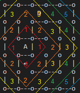
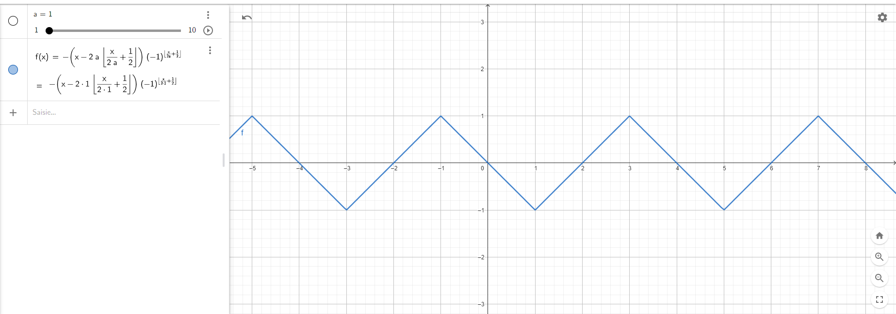

# Simulateur de Résolution de Labyrinthe

## I. Génération du labyrinthe

Avant de résoudre un labyrinthe il est nécessaire d'en générer un. Il a été trouvé pertinent de se limiter à un **labyrinthe parfait**. Cela se traduit par le fait que le chemin du labyrinthe passe par toutes ses cases, et que tous ses murs sont reliés entre eux.

A noter que pour un labyrinthe de taille NxN, le nombre de murs est fixe et vaut : 4*N + (N-1)^2

(*source : https://micromouseonline.com/2011/12/03/how-many-walls-do-you-need-for-a-square-maze/*)

L'algorithme retenu pour la génération de labyrinthe est "Hunt & Kill":
1. On choisit une case
2. On "marche" aléatoirement, taillant un passage vers les cases voisines non parcourues, jusqu'à n'avoir plus que des voisins parcourus
3. On entre dans le mode "chasse", où l'on scanne le labyrinthe jusqu'à trouver une case non visitée adjacente à une case parcourue.
4. On répète les étapes 2 et 3 jusqu'à que le mode "chasse" scanne le labyrinthe entièrement sans trouver de cases non parcourues.

(*source : https://weblog.jamisbuck.org/2011/1/24/maze-generation-hunt-and-kill-algorithm*)

## II. Résolution
### 1) Idées principales

Pour chaque algorithme, on détermine l'action à entreprendre parmi :
* avancer
* tourner à droite
* tourner à gauche
* faire demi-tour

On connaît à l'avance la dimension du labyrinthe (qui est toujours carré), mais pas l'emplacement des murs. Ainsi, on simule la cartographie des murs à chaque fois que l'on se déplace. C'est-à-dire : chaque fois que le robot se déplace, il enregistre la présence ou non de mur sur sa droite, sa gauche et en face de lui.

### 2) Aléatoire

L'idée ici est simple, on choisit aléatoirement une action parmi les 4 citées plus haut.
Donc pour agir, on ne prend rien en compte dans l'environnement du "robot" (ce qui n'est pas une bonne chose en condition réelle, car on ne veut pas endommager le robot ou son environnement).

### 3) Toujours à Droite

#### a) Logique

Premièrement, on regarde la case sur laquelle on se trouve.
Ensuite, en fonction de la situation, on choisit une action:
* Si on peut tourner à droite : *on tourne à droite*
* Sinon, si on peut avancer : *on avance*
* Sinon, si ou peut tourner à gauche : *on tourne à gauche*
* Sinon : *on fait demi-tour*

#### b) Exemple de résolution :


```
Labyrinthe
o---o---o---o
| D         |
o---o   o---o
|       |   |
o   o---o   o
|     A     |
o---o---o---o
```

*Rappel: on cartographie le labyrinthe au fur et à mesure des déplacements*

* Etape 1 :
```
o---o---o---o
| ↑         |
o---o       o
|           |
o           o
|     A     |
o---o---o---o

On tourne à droite
```

* Etape 2 :
```
o---o---o---o
|     →     |
o---o       o
|           |
o           o
|     A     |
o---o---o---o

On tourne à droite
```

* Etape 3 :
```
o---o---o---o
|           |
o---o   o   o
|     ↓ |   |
o   o---o   o
|     A     |
o---o---o---o

On tourne à droite
```

* Etape 4 :
```
o---o---o---o
|           |
o---o   o   o
| ←     |   |
o   o---o   o
|     A     |
o---o---o---o

On tourne à gauche
```

* Etape 5 :
```
o---o---o---o
|           |
o---o   o   o
|       |   |
o   o---o   o
| ↓   A     |
o---o---o---o

On tourne à gauche
```

* Etape 6 :
```
o---o---o---o
|           |
o---o   o   o
|       |   |
o   o---o   o
|     →     |
o---o---o---o

Fini
```


### 4) Poids

#### a) Logique

L'algorithme consiste à définir des poids pour chaque case du labyrinthe.
Plus une case est loin de l'arrivée, plus son poids est élevé, on utilise la norme 1 pour calculer la distance :

d(A,B) = | xA - xB | + | yA - yB |

Pour choisir l'action à entreprendre, on regarde les poids alentours (droite, haut, gauche, bas), et on se déplace sur la case avec le poids le plus faible, en prenant en compte les murs bien sûr.

Ensuite, on actualise le tableau des poids grâce à la carte actuelle, et c'est là qu'est la difficulté de mise en place de l'algorithme : **l'actualisation des poids**.

#### b) Actualisation des poids

Pour actualiser les poids, on se centre sur l'arrivée, et on actualise les cases les plus proches au plus éloignées (un peu comme des vagues). L'ensemble des points pour chaque distance d'actualisation forme un losange.



Les coordonnées des différents points de chaque losange, correspond à 2 intervalle d'une fonction triangle de paramètre **a** correspondant à la taille du losange :



Cependant, si on ne prend on considération que cette condition pour actualiser les poids, en présence de murs formant des couloirs, les cases ne s'actualiseront pas bien. 
Pour cela, il faut aussi vérifier que la case soit actualisable, c'est-à-dire : qu'au moins une case voisine est été actualisée. Si ce n'est pas le cas, on passe et on continue avec la case suivante. Bien sûr, on répète l'opération jusqu'à ce que toutes les cases soient actualisées.

#### c) Exemple de résolution:

```
Labyrinthe         Carte
o---o---o---o      o---o---o---o
| D         |      | D         |
o---o   o---o      o           o
|       |   |      |           |
o   o---o   o      o           o
|     A     |      |     A     |
o---o---o---o      o---o---o---o
```

```
Tableau des Poids associé à la carte

3  2  3
2  1  2
1  0  1
```

* Etape 1 :
```
Labyrinthe
o---o---o---o
| ↑         |
o---o       o
|           |
o           o
|     A     |
o---o---o---o

3  2  3
2  1  2
1  0  1

On tourne à droite
```

* Etape 2 :
```
o---o---o---o
|     →     |
o---o       o
|           |
o           o
|     A     |
o---o---o---o

3  2  3
2  1  2
1  0  1

On tourne à droite
```

* Etape 3 :
```
o---o---o---o
|           |
o---o   o   o
|     ↓ |   |
o   o---o   o
|     A     |
o---o---o---o

5  4  3
2  3  2
1  0  1

On tourne à droite
```

* Etape 4 :
```
o---o---o---o
|           |
o---o   o   o
| ←     |   |
o   o---o   o
|     A     |
o---o---o---o

5  4  3
2  3  2
1  0  1

On tourne à gauche
```

* Etape 5 :
```
o---o---o---o
|           |
o---o   o   o
|       |   |
o   o---o   o
| ↓   A     |
o---o---o---o

5  4  3
2  3  2
1  0  1

On tourne à gauche
```

* Etape 6 :
```
o---o---o---o
|           |
o---o   o   o
|       |   |
o   o---o   o
|     →     |
o---o---o---o

5  4  3
2  3  2
1  0  1

Fini
```